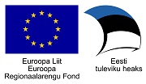

## DVK haldustegevuse muutused (seosed DHX kasutuselev�tuga)

* DHX-iga liitunud asutused lisatakse DVK andmebaasi tabelisse ASUTUS automaatselt (DHX aadressiraamatu uuendaja poolt).

* ASUTUS.DHX_ASUTUS v�li v��rtustatakse DHX-iga liitunud asutusel 1. Vanadel DVK-ga liitunud asutusel on selle v��rtus 0. 

* Kui asutus liigub DVK kasutamise pealt �le DHX kasutajaks, siis muudetakse DVK andmebaasis ASUTUS.DHX_ASUTUS v�lja v��rtus automaatselt 0 -> 1

* Kui on tarvis lisada uus DVK-d kasutav asutus, siis tuleb selle kirje lisamisel v��rtustada ASUTUS.DHX_ASUTUS=0

* Juhul, kui k�ik DHX saatmise �ritused eba�nnestuvad mingil p�hjusel, aga soovitakse ikkagi uuesti saata (n�iteks j�rgmine p�ev), siis tuleb andmebaasis v��rtustada VASTUVOTJA.dhx_internal_consignment_id=NULL ja VASTUVOTJA.staatus_id=101 

Teades DOKUMENT.ID v��rtust, v�ib seda teha SQL lausega:

```sql
UPDATE vastuvotja v SET
    v.dhx_internal_consignment_id = NULL,
    v.staatus_id = 101
WHERE v.staatus_id = 103
  AND v.transport_id IN (
    SELECT t.transport_id FROM transport t, dokument d
    WHERE t.dokument_id = d.dokument_id
      AND d.dokument_id = <VALUE> 
  ) 
```


## Lisainfo DHX saatmise j�lgimiseks:

* ASUTUS tabelisse lisatud v�li DHX_INTERNAL_CONSIGNMENT_ID (character varying(200)), mis sisaldab DVK poolt DHX-i saatmisel genereeritud saadetise id v��rtust (DHX sendDocument teenuse sisendis).

* ASUTUS tabelisse lisatud v�li DHX_EXTERNAL_CONSIGNMENT_ID (character varying(200)), mis sisaldab DHX-ist DVK-sse saabunud dokumendi saadetise id v��rtust.

* ASUTUS tabelisse lisatud v�li DHX_EXTERNAL_RECEIPT_ID (character varying(200)), mis sisaldab DHX-ist DVK-sse saabunud sendDocument p�rgingu vastuseks genereeritud recepient id v��rtust.

* VASTUVOTJA tabelisse lisatud v�li LAST_SEND_DATE (timestamp). See sisaldab kuup�eva ja kellaaeg, millel tehti viimane DHX edasi saatmise �ritus.

